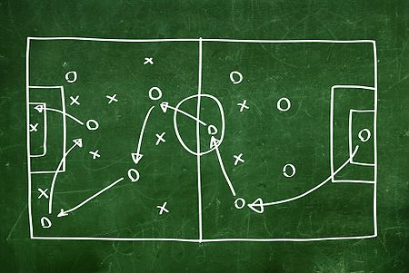
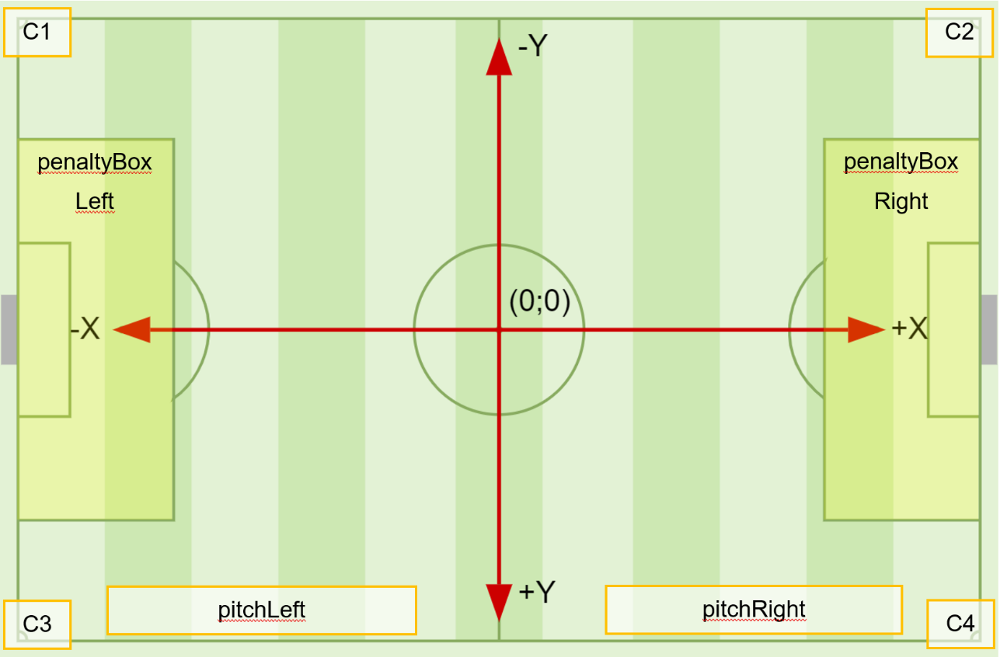
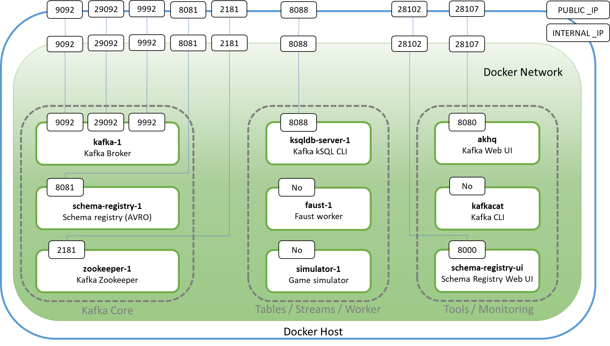
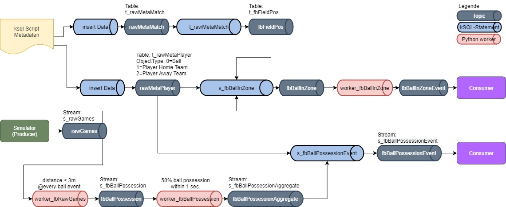
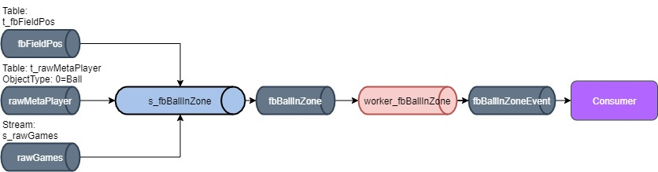
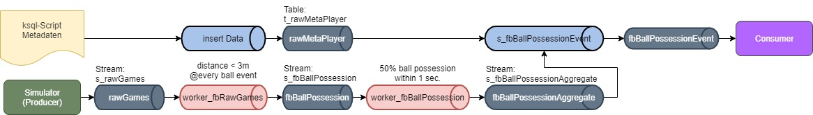
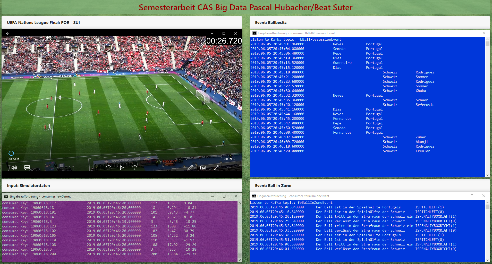

# Semesterarbeit CAS BGD FS20
Beat Suter und Pascal Hubacher

# Stream-Processing als Basis für die taktische Analyse im Spitzenfussball

## Intro
Im Spitzenfussball gehört es heute zum Standard, dass die Spielerdaten während eines Spiels auf-gezeichnet und ausgewertet werden. Nach dem Spiel können so Leistungsdaten je Spieler (Lauf-wege, Ballkontakte, gewonnene/verlorene Zweikämpfe etc.) ermittelt werden. Ein immer wichtigerer Teil nimmt dabei die Analyse von Datenströmen zu Echtzeit ein.
Im Rahmen dieser Semesterarbeit wollen wir die einzelne Komponente der Stream-Analyse und der Event-Detection an konkreten Spieldaten anzuwenden und erste Erfahrungen zu sammeln.

## Ziel der Semesterarbeit
Wir gehen die Projektarbeit aus Sicht «Data Scientist» an und weniger
als «Informatiker». Uns ist wichtig zu erfahren, wie mit den Werkzeugen
eines Data Scientist eine Stream-Verarbeitung sinnvoll gestaltet werden
kann. Der Fokus liegt dabei auf folgenden Themen:

-   Event-Detection
    > Erkennen von Spielsituationen auf Basis der Positionsdaten (x/y)
    > von Spieler und Ball

-   Einsetzen von Stream Processing Tools
    > Anwenden von ksql und Python/Faust (Data Scientist Toolset) sowie
    > die Einbindung bereits bekannter Technologien (C\#/.net)

-   Erstellen von Producer und Consumer
    > Input: Sensorsimulator (Python)
    > Output: Datenablage in externer Datenbank (.net)

-   Aufbau Kafka-Streaming-Plattform
    > Im Zentrum steht die Systembereitstellung in einer 
    Entwicklungsumgebung auf einem lokalen Windows-System, basierend auf
    Docker. Die Partitionierung und Replikation der Daten steht dabei
    nicht im Fokus.

## Einführung
Die vorliegende Arbeit basiert auf den individuellen
Positionsdatenströme der 22 Spieler und des Balls aus dem UEFA Nations
Leauge Spiel zwischen Portugal und der Schweiz vom Juni 2019. Infos zu
Spiel sind auf der Website der UEFA[^1] zu finden:

In diesem Kapitel werden einige Grundlagen rund um das Spielfeld
definiert und die Inputdaten erklärt

### Input Daten
Basis für die Event-Detection sind die Positionsdaten des Balls sowie
der 22 Spieler (1 Torhüter und 10 Feldspieler je Team). Die
Positionsdaten der 23 Objekte werden alle 40ms ermittelt, was einer
Sampling-Rate von 25Hz entspricht.

Die Daten stehen als CSV-Datei zur Verfügung. Je Objekt eine Datei. Zur
Simulation eines Live-Spiels werden die Objektdaten mit Hilfe eines
Simulator-Scripts in das System eingespeist.

Beispieldaten (CSV); Positionsdaten eines Spielers mit drei Messwerten:

Timestamp,\"X\",\"Y\",\"Z\",\"ID\"

40,50.92,1.15,0.0,101

80,50.86,1.16,0.0,101

120,50.79,1.14,0.0,101

### Fussballfeld Koordinatensystem
Der Ursprung des Koordinatensystems liegt auf dem Spielfeldmittelpunkt.

**Wichtig**: Die Spielfeldgrösse (Länge und Breite) ist nicht fix
definiert, sondern kann in einem reglementarisch definierten Bereich
variieren. Die Grösse von Strafraum, Torraum und Tor ist jedoch fix
definiert.

Die offizielle Vermassung und die Beschreibung des Fussballfelds sind
auf Wikipedia[^2] zu finden.

## Events

Auf Basis der Positionsdaten der Spieler und des Balls werden
verschiedene Ereignisse erkannt (Event detection). Events können von der
absoluten Spielfeldposition, Laufrichtung und Geschwindigkeit eines
Objekts abhängig sein, der relativen Geschwindigkeit oder des Abstands
zweier Objekte untereinander. Diese Zustände werden dann meist auch in
Abhängigkeit der Zeit betrachtet.

Zum Beispiel ein Ballbesitz kann definiert werden durch einen minimalen
Abstand zwischen zwei Objekten (Ball und Spieler) und der gleichen
Bewegungsrichtung.

Wir unterscheiden zwischen einfachen Events und komplexen Events.

-   Einfache Events: Ein Ereignis trifft ein, unabhängig von anderen
    Ereignissen. Zum Beispiel ein Objekt betritt oder verlässt eine
    bestimmte Spielfeldzone

-   Complex Event: Erkennung von Ereignismustern. Einfache Events werden
    zu Gruppen zusammengefasst und bilden ein übergeordnetes Ereignis.
    Mehrere Objekte stehen in Beziehung zueinander.

### Liste der Events

Die folgenden Events werden im Rahmen dieser Arbeit aus den Datenströmen
gefiltert.

#### Einfache Events; Zoneninformationen

Anhand der eingangs beschriebenen Spielfeldzonen wird erkannt, wann der
Ball eine definierte Zone verlässt oder in sie eindringt. Die
Ballposition(x/y) wird mit den Zonenkoordinaten
verglichen(x~min~/y~min~; x~max~/y~max~)

#### Complex Events; Ballbesitz

Der Ball ist das zentrale Objekt. Seine Position (x/y) wird mit den
Positionen der Spieler(x/y) über einem bestimmte Zeitpunkt verglichen.

Erkennt, ob ein Spieler im Ballbesitz ist und es vorher nicht war. Damit
dieser Event anschlägt, muss die Distanz des Spielers zum Ball unter 3
Meter sein und kein anderer Spieler näher beim Ball sein. Weiter muss
der Spieler innerhalb eines Zeitfensters von 1 Sekunde diesen Zustand
mehr als die Hälfte der Zeit innehalten.

## Infrastruktur

### Übersicht

Damit eine Umgebung ohne grosse Vorkenntnisse eingesetzt werden kann,
ist es wichtig, dass der Aufbau derselben einfach und fehlerresistent
ist. Bereits in einer vorangegangenen Arbeit wurde eine Umgebung
aufgebaut für die Analyse von Fussball Stream Daten. Diese wurde jedoch
lokal auf einem Server installiert und konnte nach der Arbeit nicht mehr
migriert und weiterverwendet werden.

Deshalb ist es ein Kernthema dieser Arbeit, dass die ganze Umgebung
folgende Eigenschaften haben muss:

-   Betriebssystemneutral

-   Einfach portierbar (Lokal/Cloud)
    > Minimalinstallation: Laptop (32GB RAM, Mehrere CPU Kerne)\
    > Maximalinstallation: Server oder Cloud Implementation

-   Schnell einsetzbar (30min)

-   Geringer Speicherbedarf

-   Einfache Erweiterbarkeit (Modularer Aufbau, Python, KSQL)

-   Einfache Entwicklung mit GitHub (Multiuserfähig, Änderungen
    nachverfolgbar)

-   Einfache Automatisierung

-   Kostengünstig

-   Enterprise Support

Aufgrund dieser Anforderungen haben wir uns für Docker entschieden.
Docker lässt sich auf allen gängigen OS installieren. Die Kommandos sind
fast identisch in der Anwendung.

Die hier verwendete Minimalumgebung wird mittels docker-compose
erstellt. Dabei werden die angepassten Images mittels Docker File
erstellt. Somit ist die ganz Umgebung einfach portierbar und
erweiterbar.

Die ganze Semesterarbeit[^3] ist eine Teamarbeit und bedarf, dass jede
Person jederzeit am Projekt arbeiten kann. Deshalb ist die ganze
Umgebung auf GitHub abgelegt und wird auch dort gepflegt.

Auf Windows 10 setzen wir GitHub Desktop ein und als Programmierumgebung
dient Visual Studio Code mit Python 3.7.

### Docker

Damit Docker verwendet werden kann, muss erst die Docker Umgebung
installiert werden. Diese beinhaltet den Docker Server (Docker Prozess)
und den Docker Client (Docker CLI). Mit dieser CLI (Docker und
Docker-Compose) kann anschliessend die ganze Umgebung betrieben werden.

Docker stellt eine Virtualisierung mittels Container dar. Die Container
sind jedoch keine volle OS Virtualisierung und deshalb ist deren
Platzbedarf meist massiv kleiner. Die Container werden immer aus einem
Image gestartet. Das Image stellt ein Filesystem Snapshot einer Unix
Umgebung dar.

Der Docker Hub stellt eine Vielzahl von offiziellen Images und auch
selbstkreierten Images (keine Qualitätskontrolle) bereit, welche direkt
mittels Docker CLI heruntergeladen werden können.

Ein Docker Hub Image dient meist als Basis und wird anschliessend
mittels einer deklarativen Konfigurationsdatei (DOCKERFILE) für die
weitere Verwendung angepasst und kann danach wieder als eigenes Image
lokal abgespeichert werden. Die Container sind untereinander
abgeschottet. Wollen die Container miteinander kommunizieren, müssen sie
dies über freigegebene TCP/IP Ports tun oder den Containern wird ein
geteiltes Verzeichnis im Container angehängt.

Damit nun eine ganze Umgebung, bestehend aus mehreren Containern,
einfach aufgebaut werden kann, braucht es die Docker-Compose CLI. Mit
dem Docker-Compose Kommando kann mittels einer deklarativen
Konfigurationsdatei (Docker-Compose.VML) eine ganze Umgebung in einem
gemeinsamen Netzwerk aufgebaut werden. Diese Umgebung kann danach als
Ganzes gestartet, gestoppt, neu aufgebaut oder abgebaut werden.

### Docker Umgebung

Die verwendete Docker Umgebung basiert auf der Docker-Compose[^4] Datei
von Guido Schmutz. Aufgrund dessen war es uns möglich, innerhalb
kürzester Zeit eine lauffähige Kafka Umgebung bereitzustellen.

Die Docker Umgebung ist in ein internes und ein externes Netzwerk
unterteilt (Internal_IP, External_IP), damit die gesamte Umgebung auch
sicher in der Cloud laufen kann. Durch die Unterteilung ist es möglich,
gewisse Ports der Applikationen nur im Docker Netzwerk verfügbar zu
machen und nur die zwingend benötigten Ports nach aussen zu öffnen.

#### Game Simulator (simulator-1)

Der «Game Simulator» dient dazu, die in unserer Semesterarbeit
verwendeten Fussballspieldaten in Echtzeit an Kafka zu senden.
Die Events werden im JSON Format versendet. Das verwendete Schema dazu
wird nicht in der Schema Registry gespeichert und muss deshalb in jedem
«Consumer/Producer» neu angegeben werden.

#### Faust worker (faust-1)

Der Faust Container wird verwendet um sogenannte «Worker» auszuführen.
Worker lesen die Messages ab einem dedizierten Topic, führen eine meist
komplexere Verarbeitung durch und generieren mit dem Resultat eine neue
Message in ein weiteres Topic.

Der Vorteil eines solchen Workers ist, dass Streams und Tables dadurch
relativ einfach programmiert werden können. Durch den Einsatz einer
Programmiersprache ist es einfach, zum Beispiel die Distanz anhand der
X/Y Koordinaten in zwei Messages zu berechnen. Dies wäre mittels KSQL
komplexer umzusetzen.

Als Standard gilt hier Kafka Streams. Kafka Streams unterstützt jedoch
nur die Programmiersprachen Java und Scala. Als Alternative für die
Worker-Umsetzung bietet sich Python mit der Faust-Library[^6] an. Für
den Data Scientist eine äusserst spannende Alternative, für welche wir
uns in unserem Projekt entschieden und erfolgreich eingesetzt haben.

Faust ist eine Stream Processing Bibliothek, welche die Ideen von Kafka
Streams nach Python portiert hat. Mittels Faust ist es relativ simpel,
aus Topics und Tabellen zu lesen und zu schreiben.

Die einzelnen Faust Apps kreieren im Hintergrund ein «changelog» Topic
in Kafka für seine geführten Tabellen, damit beim Absturz eines Workers
die Daten nicht verloren gehen und beim Neustart des Workers abgeglichen
werden können. Dadurch kann der Faust-Worker mit Kafka
Verbindungsverlusten und Problemen der Faust App umgehen.

#### Zookeeper (zookeeper-1)

Der Zookeeper (kann auch mehrere Nodes davon geben) fungiert als Hirn
der Kafka Umgebung. Ohne Zookeeper funktioniert die Kafka Umgebung
nicht. Der Zookeeper Service ist verantwortlich, dass die Namens- und
Konfigurationsinformationen auf dem verteilten System synchronisiert
werden. Zookeper überwacht den Status der Kafka Nodes, Topics und
Partitions.

#### Kafka Broker (kafka-1)

Der Kafka Broker speichert die Daten. In einer verteilten Kafka Umgebung
kann es fast beliebig viele Kafka Broker geben. Kafka (Zookeeper)
definiert selber, auf welchem Broker welche Daten abgespeichert werden.
Dies geschieht automatisch nach vorgegebenen Regeln (Round Robin, Sticky
Routing).

#### Kafka Web UI (akhq)

Dieses Image dient dazu, mittels Web UI die Kafka Umgebung anzuschauen
(Nodes, Topics) und bei Bedarf anzupassen. In unserer aufgebauten
Umgebung ist der Web UI Port im externen Netzwerk sichtbar und dadurch
lässt sich die Umgebung praktisch überwachen und anpassen. Im Browser
lässt sich die Kafka Umgebung wie folgt aufrufen:
<http://localhost:28107/docker-kafka-server/node>.

#### Kafka kSQL Server (ksqldb-server-1)

Der kSQL Server ist die SQL Engine für Kafka. Mit kSQL können nun
komplexe Operationen (Aggregationen, Joins, Windowing) auf SQL-Basis
durchgeführt werden. Der kSQL Server lässt sich auch mittels RestAPI
ansprechen, so dass SQL-Statements einfach in Python abgesetzt werden
können.

## Kafka Modellierung

### Überblick

Kommen wir zum Kernstück unserer Semesterarbeit. Die Modellierung der
Stream-Verarbeitung in Kafka mit den Topics, Streams, Tabellen und
Worker.

Das folgende Schema zeigt uns das Zusammenspiel dieser verschiedenen
Objekte und den Weg von den Rohdaten aus dem Simulator zu den beiden
Haupt-Events «BallInZone» und «BallPossession», die je durch einen
separaten Consumer ausgelesen werden.

Initial werden mit Hilfe eines KSQL-Scripts die Topics, Streams und
Tabellen erstellt und anschliessend, auch via KSQL-Script, die
Meta-Spieldaten (Spielfeld- und Sensorinformationen) eingefügt. Wir
unterscheiden zwischen den statischen Meta-Spieldaten und den
Sensordaten (Positionsdaten) ab dem Simulator. Um in KSQL Daten via
Stream oder Tabelle zu verarbeiten, muss die Datenstruktur der Topics
definiert werden. Dies erfolgt in unserer Implementation durch das
Statement CREATE STREAM oder CREATE TABLE.

### Use Cases

#### Ball in Zone -- fbBallInZoneEvent

Tritt der Ball in eine Spielfeldzone ein oder verlässt diese, wird eine
Message in das Topic *fbBallInZoneEvent* geschrieben.

Die Event-Detection erfolgt über zwei Schritte

1.  STREAM s_fbBallInZone: Datenstrom nach Ball filtern und aktuelle
    Zone feststellen

2.  WORKER worker_fbBallInZone: Zonenwechsel feststellen

#### Ballbesitz -- fbBallPossessionEvent

Der Ballbesitz Event besteht aus den Spielerinformationen in der Tabelle
«rawMetaPlayer» und der Auswertung der Spieler- und Ballpositionsdaten
aus dem Stream «rawGames».

Visualisierung/Test
-------------------

Zur einfachen Überprüfung unserer Event-Detection werden die Events
zusammen mit dem Video des Spies am Bildschirm gemeinsam angezeigt. Dazu
werden die Consumer auf die Event-Topics «fbBallInZoneEvent» und
«fdBallPossessionEvent» sowie das Input-Topic «rawGames» in separaten
Terminalfenster geladen. Anschliessend wird der Input-Stream über den
Simulator gemeinsam mit dem Video gestartet. Die Events werden bei
auftreten sofort im entsprechenden Terminalfenster dargestellt. So kann
die visuelle Überprüfung der Richtigkeit der Events gewährleistet
werden.

